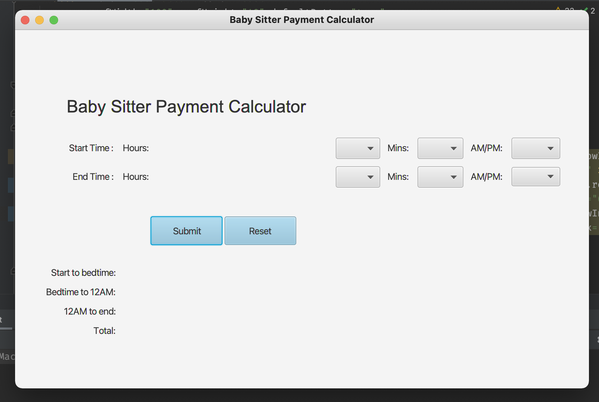

#Ohio health Coding Challenge

***
### Step to run the program ###
* Download the file 
* Import the project in your IDE or simply copy paste com.babysitter package to your existing application
* Right click on `Main.java` and click run
* You should be able to see result like in below image
* 
***
### Assumption/Scenario
* Since bed-time wasn't mention on a requirement. I picked bedtime to be 9PM. 
* Minutes are not calculated. Every calculation is based on hours.
* I pick Java FX for this project because I wanted to show a GUI version of project.
***
